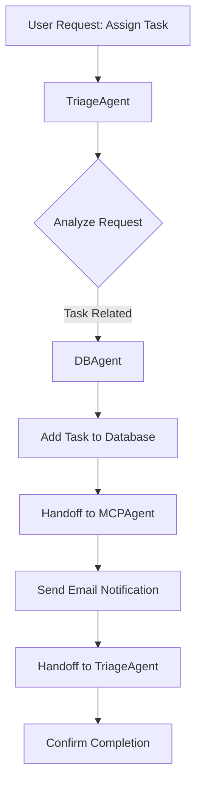
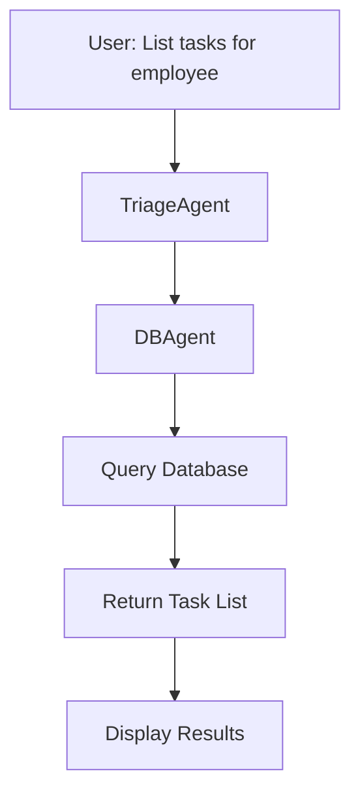
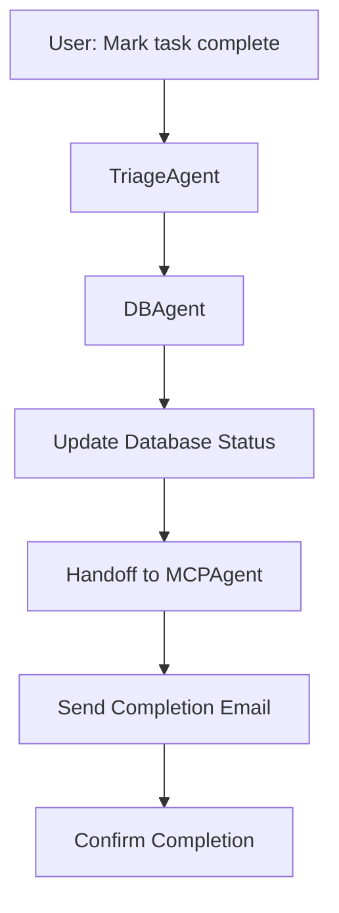
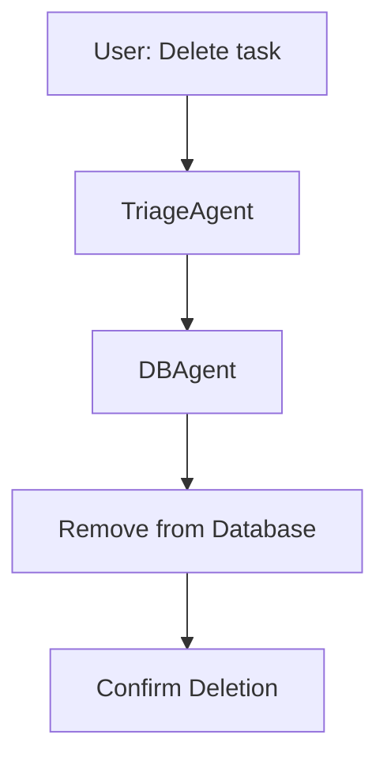
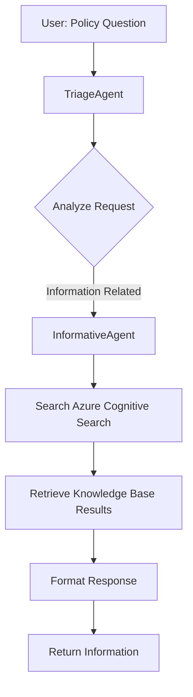
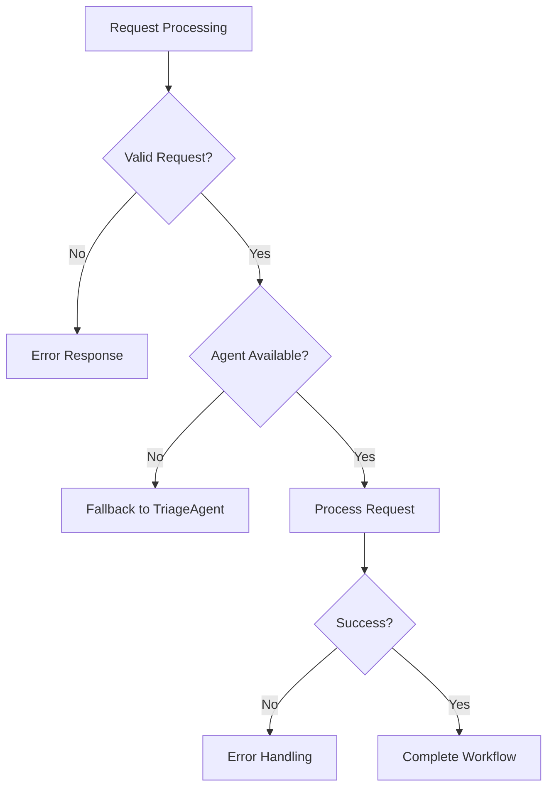

# SMNT-KRNL System: Complete Data Workflow Documentation

## System Overview

SMNT-KRNL is an intelligent task management and information retrieval system built with Microsoft Semantic Kernel. It uses a multi-agent architecture to handle different types of user requests through specialized agents that can handoff tasks to each other.

## Architecture Components

### 1. Core Infrastructure
- **Semantic Kernel**: Microsoft's AI orchestration framework
- **Azure OpenAI**: GPT-4 for natural language processing
- **SQLite Database**: Task storage and management
- **Azure Cognitive Search**: Company knowledge base search
- **SMTP Email Service**: Task notification system

### 2. Agent Architecture
The system uses 4 specialized agents:

#### TriageAgent
- **Role**: Entry point and request router
- **Responsibilities**: 
  - Analyze incoming user requests
  - Determine appropriate agent for handling
  - Route requests to specialized agents
- **Handoff Targets**: DBAgent, InformativeAgent, MCPAgent

#### DBAgent
- **Role**: Task management specialist
- **Responsibilities**:
  - Add new tasks to database
  - List pending tasks for employees
  - Mark tasks as completed
  - Delete tasks
- **Handoff Targets**: TriageAgent, MCPAgent
- **Plugins**: DBAgentPlugin

#### InformativeAgent
- **Role**: Company information specialist
- **Responsibilities**:
  - Search company knowledge base
  - Provide policy information
  - Answer HR and guideline questions
- **Handoff Targets**: TriageAgent
- **Plugins**: InformativeAgentPlugin

#### MCPAgent
- **Role**: Email notification specialist
- **Responsibilities**:
  - Send task assignment notifications
  - Send task completion notifications
  - Handle email communications
- **Handoff Targets**: TriageAgent
- **Plugins**: MCPPlugin

## Data Flow Workflows

### Workflow 1: Task Assignment (Primary Use Case)



**Detailed Steps:**
1. **User Input**: "assign a new task to jamil to close the project"
2. **TriageAgent**: Analyzes request, identifies as task-related
3. **Handoff**: `Handoff-transfer_to_DBAgent` with `{}`
4. **DBAgent**: Requests additional information (email, due date)
5. **User Input**: Provides email address
6. **DBAgent**: Calls `DBAgentPlugin-add_task` with parameters:
   ```json
   {
     "employee": "jamil",
     "email": "mhd.alhafez9@gmail.com", 
     "description": "close the project",
     "due_date": "today"
   }
   ```
7. **Database**: Task inserted into SQLite `tasks` table
8. **Handoff**: `Handoff-transfer_to_MCPAgent` with `{}`
9. **MCPAgent**: Calls `MCPPlugin-send_task_notification` with:
   ```json
   {
     "recipient_email": "mhd.alhafez9@gmail.com",
     "subject": "New Task Assigned: close the project",
     "body": "You have been assigned a new task: close the project. Please ensure to complete it timely. Thank you!"
   }
   ```
10. **Email Service**: SMTP sends notification via Gmail
11. **Handoff**: `Handoff-transfer_to_TriageAgent` with `{}`
12. **Completion**: System confirms task assignment and email sent

### Workflow 2: Task Management Operations

#### List Pending Tasks


#### Mark Task Complete


#### Delete Task


### Workflow 3: Information Retrieval



**Detailed Steps:**
1. **User Input**: "What is the company vacation policy?"
2. **TriageAgent**: Identifies as information request
3. **Handoff**: `Handoff-transfer_to_InformativeAgent` with `{}`
4. **InformativeAgent**: Calls `InformativeAgentPlugin-search_knowledge_base`
5. **Azure Search**: Queries company knowledge base
6. **Results**: Returns relevant policy documents
7. **Response**: Formatted policy information provided to user

### Workflow 4: Error Handling and Fallbacks



## Database Schema

### Tasks Table
```sql
CREATE TABLE tasks (
    id INTEGER PRIMARY KEY AUTOINCREMENT,
    employee TEXT NOT NULL,
    description TEXT NOT NULL,
    due_date TEXT,
    status TEXT DEFAULT 'pending'
);
```

**Sample Data:**
```sql
INSERT INTO tasks (employee, description, due_date, status) VALUES
('jamil', 'close the project', 'today', 'pending'),
('walid', 'finish the case for the client', 'today', 'pending');
```

## Configuration Management

### Environment Variables (config.env)
```env
# Azure OpenAI Configuration
AZURE_OPENAI_API_KEY=your_api_key
AZURE_OPENAI_ENDPOINT=your_endpoint
AZURE_OPENAI_DEPLOYMENT=gpt-4

# Azure Search Configuration  
AZURE_SEARCH_ENDPOINT=your_search_endpoint
AZURE_SEARCH_INDEX=your_index_name
AZURE_SEARCH_API_KEY=your_search_key

# Email Configuration
SENDER_EMAIL=your_email@gmail.com
APP_PASSWORD=your_app_password
```

## Handoff Mechanism

### Handoff Configuration (orchestrator.py)
```python
handoffs = (
    OrchestrationHandoffs()
    .add_many(
        source_agent=triage_agent.name,
        target_agents={
            db_agent.name: "Transfer to this agent if the issue is related to tasks or assignments.",
            informative_agent.name: "Transfer to this agent if the issue is related to company policies or information.",
            mcp_agent.name: "Transfer to this agent if a task was added or completed and a notification must be sent."
        },
    )
    .add(source_agent=db_agent.name, target_agent=triage_agent.name, description="Transfer to this agent if the issue is not task-related.")
    .add(source_agent=db_agent.name, target_agent=mcp_agent.name, description="Transfer to this agent when a task is added or completed and an email notification needs to be sent.")
    .add(source_agent=informative_agent.name, target_agent=triage_agent.name, description="Transfer to this agent if the issue is not information-related.")
    .add(source_agent=mcp_agent.name, target_agent=triage_agent.name, description="Transfer to this agent after the notification has been sent.")
)
```

### Handoff Function Format
All handoff functions follow the pattern:
- **Function Name**: `Handoff-transfer_to_[AgentName]`
- **Arguments**: Empty JSON object `{}`
- **Plugin**: `Handoff`

## Use Cases Summary

### 1. Task Assignment Use Case
- **Input**: Natural language task assignment request
- **Process**: TriageAgent → DBAgent → Database → MCPAgent → Email
- **Output**: Task created in database + Email notification sent

### 2. Task Management Use Case
- **Input**: Task listing, completion, or deletion requests
- **Process**: TriageAgent → DBAgent → Database operations
- **Output**: Task status updates or task lists

### 3. Information Retrieval Use Case
- **Input**: Company policy or guideline questions
- **Process**: TriageAgent → InformativeAgent → Azure Search
- **Output**: Relevant policy information from knowledge base

### 4. Email Notification Use Case
- **Input**: Task events requiring notifications
- **Process**: Any Agent → MCPAgent → SMTP Service
- **Output**: Email notifications sent to relevant parties

## Error Handling

### Database Errors
- Connection failures: Graceful error messages
- Query failures: Rollback and error reporting
- Data validation: Input sanitization and validation

### Email Errors
- SMTP failures: Error logging and user notification
- Invalid email addresses: Validation before sending
- Network issues: Retry mechanisms

### Agent Errors
- Handoff failures: Fallback to TriageAgent
- Plugin errors: Error messages and graceful degradation
- Timeout handling: Request timeout management

## Performance Considerations

### Database Performance
- SQLite for lightweight, single-user operations
- Indexed queries for fast task retrieval
- Connection pooling for efficiency

### Search Performance
- Azure Cognitive Search for fast knowledge retrieval
- Cached results for frequently accessed information
- Optimized query patterns

### Email Performance
- Asynchronous email sending
- Queue management for bulk notifications
- Error handling for failed deliveries

## Security Considerations

### Data Protection
- Environment variables for sensitive configuration
- SQL injection prevention through parameterized queries
- Email authentication via app passwords

### Access Control
- Agent-based access control
- Function-level permissions
- Audit logging for all operations

## Monitoring and Logging

### System Monitoring
- Agent handoff tracking
- Database operation logging
- Email delivery status
- Error rate monitoring

### Performance Metrics
- Response time tracking
- Success/failure rates
- Resource utilization
- User interaction patterns

## Future Enhancements

### Planned Features
1. **Multi-user Support**: User authentication and role-based access
2. **Advanced Analytics**: Task completion metrics and reporting
3. **Integration APIs**: REST API for external system integration
4. **Mobile Support**: Mobile-optimized interface
5. **Advanced Search**: Semantic search with AI-powered ranking
6. **Workflow Automation**: Custom workflow creation and management

### Scalability Considerations
1. **Database Migration**: Move from SQLite to PostgreSQL/MySQL
2. **Microservices**: Split agents into separate services
3. **Load Balancing**: Distribute agent processing
4. **Caching Layer**: Redis for improved performance
5. **Message Queues**: RabbitMQ for reliable message handling

## Conclusion

The SMNT-KRNL system provides a robust, scalable solution for task management and information retrieval using modern AI technologies. The multi-agent architecture ensures specialized handling of different request types while maintaining system flexibility and extensibility.

The handoff mechanism allows for seamless transitions between agents, ensuring that complex workflows can be handled efficiently. The integration with Azure services provides enterprise-grade capabilities for search and AI processing.

This system demonstrates best practices in AI orchestration, agent-based architecture, and modern software development patterns suitable for enterprise environments.
